| [Home](../README.md) |
|----------------------|

# Usage

In this section, we detail the various user flows to understand the scenarios where this solution pack's automation may address your needs.

## Outbreak Response Framework Flow

The following is an ideal flow to use the **Outbreak Response Framework** solution pack:

1. Install **Outbreak Response Framework** solution pack.

2. Complete the *Outbreak Response Framework*'s **Configuration Wizard**. The [Setup](./setup.md#setup-outbreak-response-framework-on-fortisoar) section details the configuration process.

3. Install individual *Outbreak Response* solution packs.
    
>[!Note]
>The [**EXAMPLE: Outbreak Response - Progress MOVEit Transfer SQL Injection Vulnerability**](#example-outbreak-response---progress-moveit-transfer-sql-injection-vulnerability) section explains the **Outbreak Response Framework** solution pack's response to *Progress MOVEit Transfer SQL Injection Vulnerability* by way of an example.

4. **Fetch CVEs for KEVs**: Using [NIST](https://docs.fortinet.com/fortisoar/connectors/nist-nvd) integration FortiSOAR checks if an associated CVE is tagged as a KEV. Once found, it creates CVE records in the vulnerability module and links those records to outbreak alerts. Following image shows a CVE record and the information it contains for enhanced threat context:

    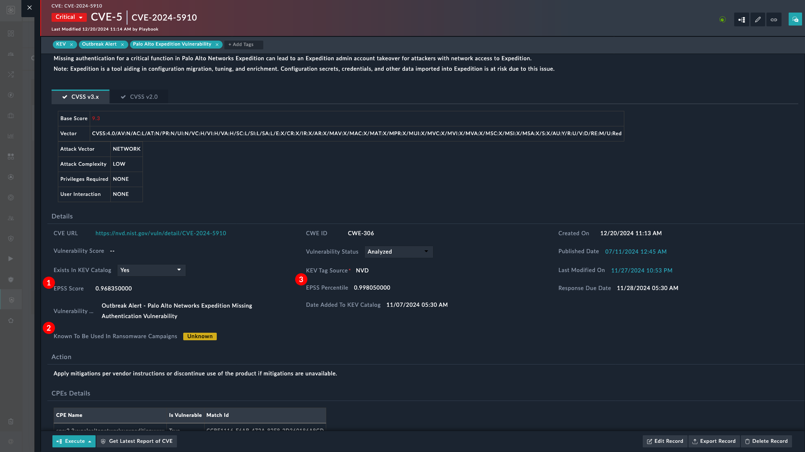

> [!Note]
> Due to API issues from NIST, the CVEs and their subsequent information may not update immediately. Refer to the section [Retrieving CVE Information from NIST](#retrieving-cve-information-from-nist) for updating CVEs.

5. **Ingest IOCs as Threat Feeds**: IOCs associated with the Outbreak are ingested as threat feeds in FortiSOAR using Fortinet FortiGuard Outbreak connector.

    Users are notified and the alert severity is raised if an alert containing these IOCs is found in FortiSOAR.

6. **IOC Threat Hunt**: You can perform IOC Threat Hunt, and create IOC hunt incidents of type *Outbreak* in FortiSOAR, using any of the following:

    - Fortinet Fabric solutions (FortiSIEM/FortiAnalyzer)

    - Other SIEM solutions (QRadar/Splunk)

7. **Sigma Rules**: You can perform signature Based Threat Hunt using Sigma Rules:

    1. Perform Signature-based Threat Hunting using Fortinet Fabric solutions (FortiSIEM/FortiAnalyzer) and create incidents of type *Outbreak* in FortiSOAR.

        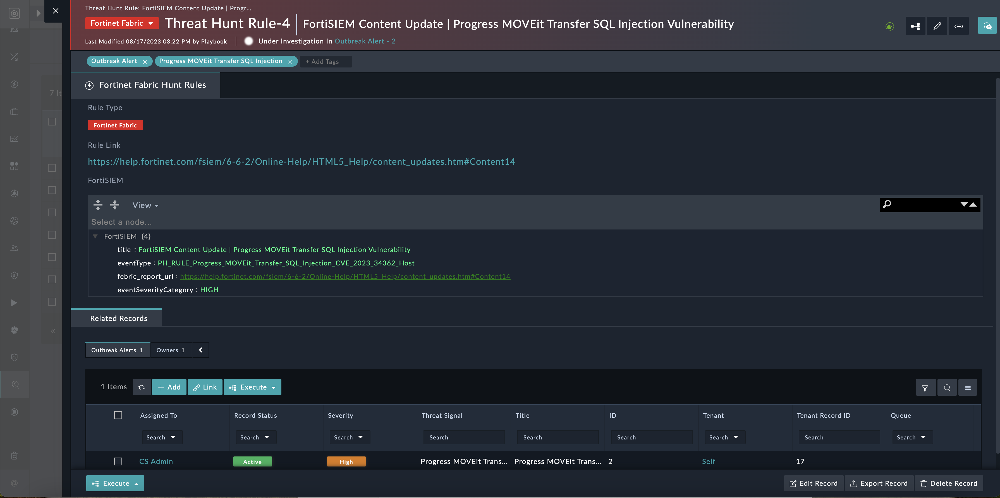

        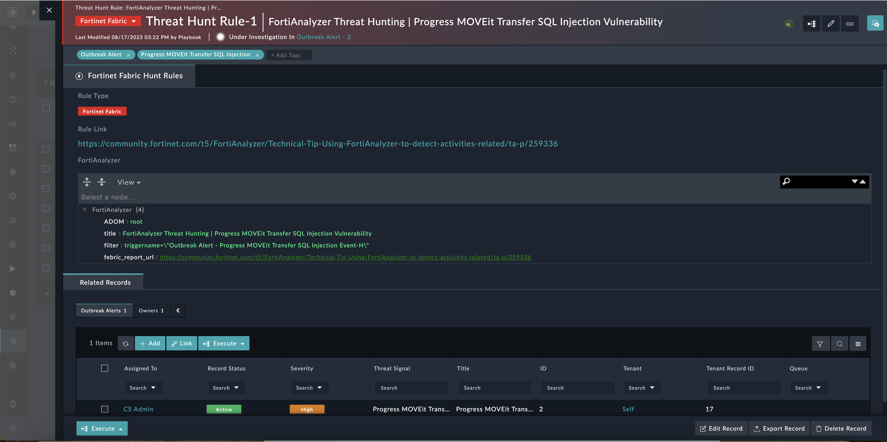

    2. Perform Signature-based Threat Hunting using other SIEM solutions (QRadar/Splunk) and create incidents of type *Outbreak* in FortiSOAR.

        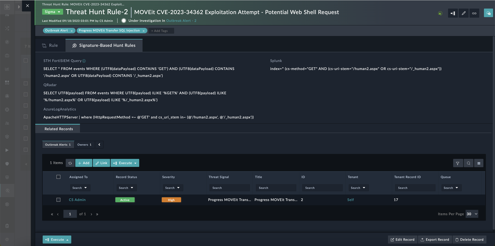

        Once investigation completes, an incident is created using the targeted IoCs found.

        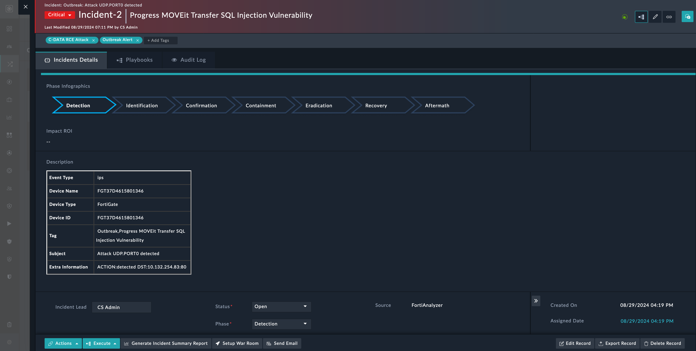

8. **Mitigation**: Every Outbreak Alert has associated mitigation. FortiSOAR provides the mitigation recommendations using public sources, like patch available, etc.

    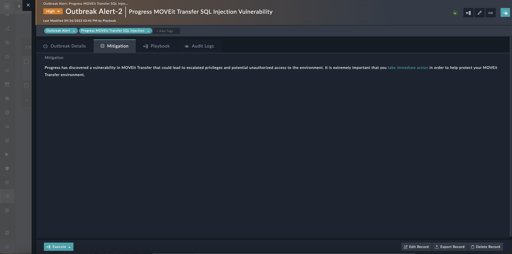

> [!Note]
> The process of updating critical information, for Outbreak Alerts with the statuses *New* or *Tracking*, is now automated. The playbook **Update Outbreak Alert Details** updates key details such as CVEs, background information, and descriptions and is scheduled to run daily. You can review the schedule `Outbreak_Alert_Fetch_Latest_Details` to modify the run frequency.

## Dashboards

The **Dashboards** section of the *Outbreak Response Framework* provides SOC analysts with a comprehensive view of ongoing security outbreaks, threat intelligence, and vulnerability tracking. These interactive dashboards enable swift analysis, monitoring, and response to emerging security threats.

### Outbreak Response Overview

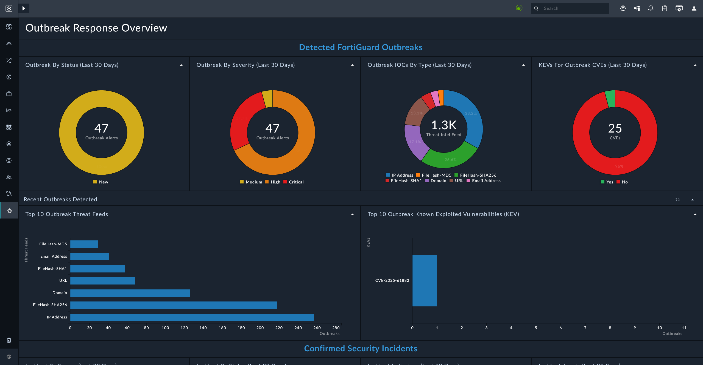

- **Purpose**: Provides a high-level summary of outbreak alerts, helping analysts understand the current threat landscape.
- **Key Features**:

  - **Outbreak Alerts by Status**: Displays the total number of outbreaks, categorized by their current status (e.g., Tracking, Resolved).
  - **Outbreak Alerts by Severity**: Breaks down outbreaks into different severity levels (Critical, High, Medium, Low), enabling analysts to prioritize responses.
  - **Outbreak Indicators of Compromise (IOCs)**: Shows a distribution of IOCs by type (IP addresses, file hashes, domains, URLs, etc.), helping analysts identify the nature of threats.
  - **Monitored CVEs by Severity**: Provides an overview of CVEs being tracked, grouped by their severity to highlight the most urgent vulnerabilities.
  - **CVE Exploitation by Year**: Visualizes the distribution of CVEs by the year they were exploited, assisting analysts in identifying emerging vulnerabilities.

### Threat Intel Overview

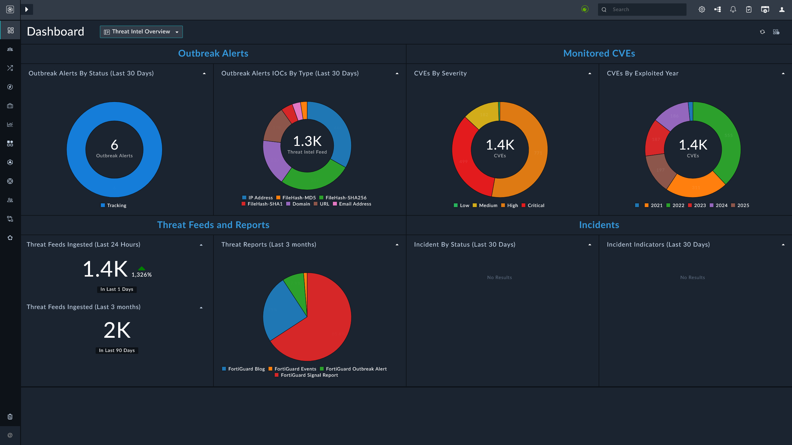

- **Purpose**: Offers an overall view of the threat intelligence data, helping analysts assess the breadth of ongoing threats and outbreak activities.
- **Key Features**:

  - **Outbreak Alerts by Status (Last 30 Days)**: Displays the number of outbreaks detected in the last 30 days and their current status (e.g., Tracking, Resolved).
  - **Outbreak Alerts IOCs by Type**: Provides a breakdown of outbreak IOCs (IP Address, FileHash-MD5, FileHash-SHA256, Domain, URL, etc.), offering a detailed look at the types of threats.
  - **Threat Feeds Ingested**: Tracks the number of threat feeds ingested within a set time frame (e.g., last 24 hours, last 3 months), offering visibility into the volume of incoming threat data.
  - **Threat Reports**: Categorizes incoming threat reports by source (e.g., FortiGuard Events, Outbreak Alerts), enabling analysts to correlate data and gain insights into emerging threats.
  - **Monitored CVEs by Severity**: Shows the CVEs being monitored, categorized by severity to help analysts focus on critical vulnerabilities.

### Threat Intel Insights Report

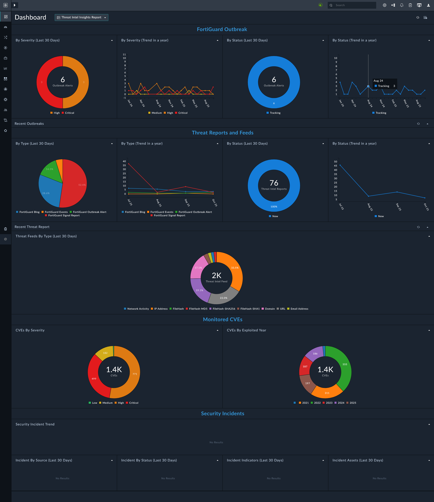

- **Purpose**: Provides deeper insights into ongoing threats and outbreak data, supporting detailed analysis for response and mitigation.
- **Key Features**:

  - **FortiGuard Outbreaks by Severity**: Displays the number of FortiGuard-related outbreaks, broken down by severity, helping analysts prioritize critical incidents.
  - **Recent Threat Reports**: Offers a detailed list of recent threat reports, categorized by type (e.g., FortiGuard Outbreak Alert, FortiGuard Signal Report), to aid in understanding the latest threats.
  - **Top 10 Outbreak Threat Feeds**: Lists the top 10 threat feeds that contributed to detected outbreaks, helping analysts focus on the most impactful sources of threat data.
  - **Outbreak Indicators by Type**: Analyzes outbreak IOCs to show which types of indicators (file hashes, URLs, etc.) are most commonly associated with outbreaks.
  - **Known Exploited Vulnerabilities (KEVs)**: Tracks which CVEs are actively exploited in outbreaks, highlighting vulnerabilities that need immediate attention.

> [!NOTE]
> For optimal usage of **Threat Intel Overview** and **Threat Intel Insights Report** dashboards, configure the [Threat Intel Management](https://github.com/fortinet-fortisoar/solution-pack-threat-intel-management/blob/develop/docs/setup.md#setup-threat-intel-management-on-fortisoar) solution pack.

## Example: Outbreak Response - Progress MOVEit Transfer SQL Injection Vulnerability

Before performing the steps outlined in this section, we recommend setting the global variable `Demo_mode` to `true`. Once done, the following steps generate example data for a better understanding of this solution packs functionality.

1. Install **Outbreak Response Framework** Solution Pack.

2. Complete the *Outbreak Response Framework*'s **Configuration Wizard**.

3. Install **Outbreak Response - Progress MOVEit Transfer SQL Injection Vulnerability**.

4. Navigate to the **Outbreak Management** menu and select **Outbreak Alerts** to view the following screen:

    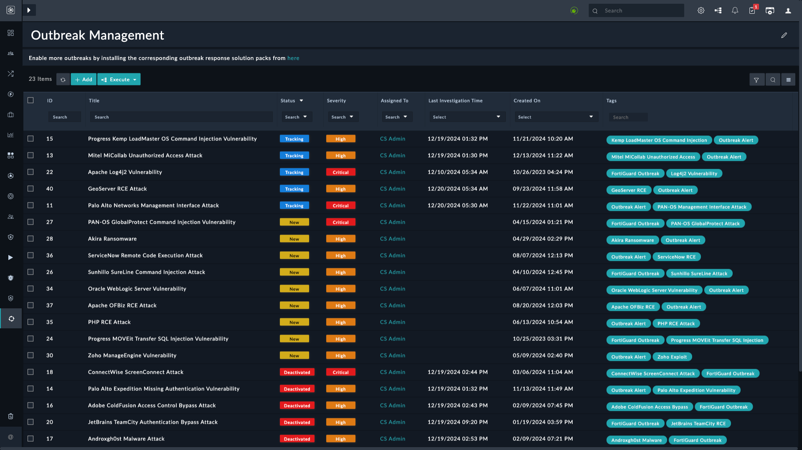

6. Click to open the alert and view the following screen that contains description and background information:

    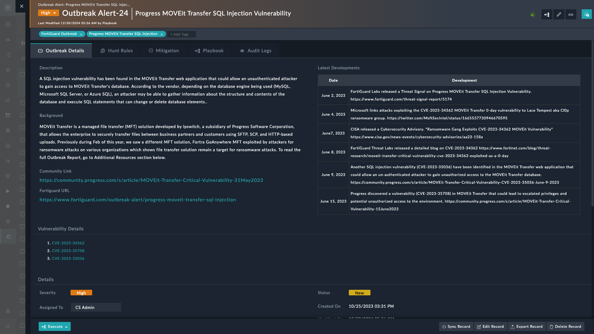

7. Click the **Execute** button and select **Investigate Outbreak** to begin investigation. Since the global variable `Demo_mode` is set to `true`, you are given example data to view and understand the information retrieved from investigation.

    Alternatively, you can click **Investigate Outbreak** button on an Outbreak Alert's detailed view page to get the following wizard:

    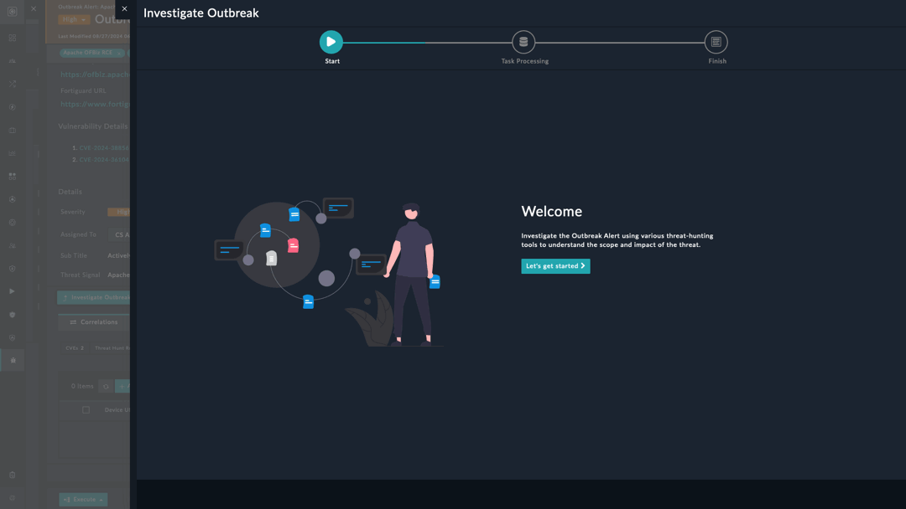

8. Scroll the alert details page to view CVE IDs, correlations, and alerts, apart from other information:

    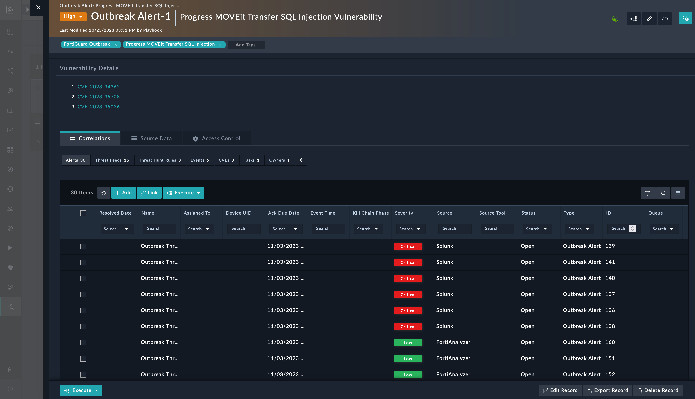

    More information becomes available as the **Outbreak Response** solution pack creates the following:

    1. **Outbreak Alerts**: An outbreak alert contains the following:

        - Outbreak Alert details

        - Mitigation Details

    2. **Threat Hunt Rules**: The following rules are imported with outbreak-specific response solution pack:

        - **Yara Rules**: YARA Rules help malware researchers identify and classify malware samples that focus on scanning and identifying malicious files.

        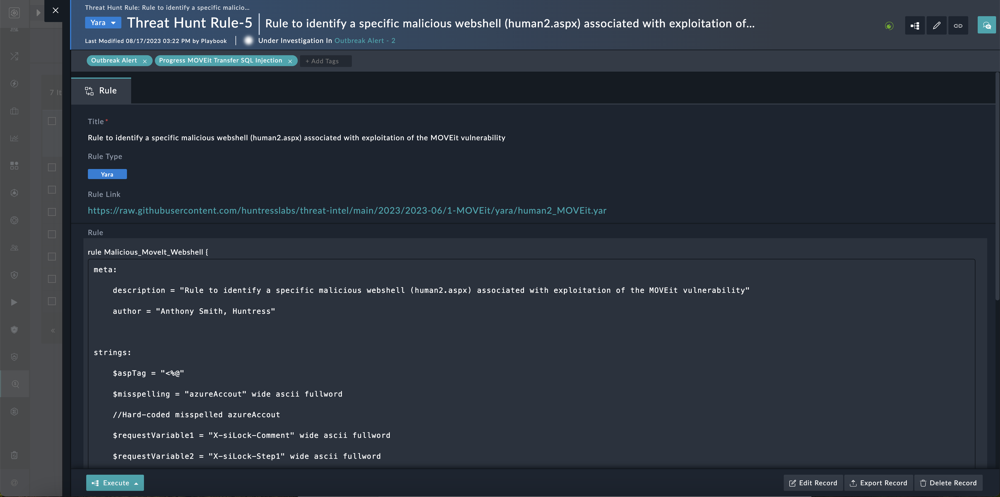

        - **Sigma Rules**: Sigma Rules provide a standard format for log events. They are helpful in searching or pattern matching through log data.
        
        Using Sigma Rules we can create signature-based Threat Hunt Rules for various Threat Detection Integrations like SIEM, Analyzer, or EDR.
        
        - **Fortinet Fabric Rules**: With every Outbreak Alert FortiGuard provides FortiAnalyzer and FortiSIEM as part of Fortinet fabric solution.

9. Select the **Dashboard** tab, under *Outbreak Management*, to view following information:

    

## Retrieving CVE Information from NIST

The CVE information from NIST is fetched as per a schedule - `Outbreak_Ingest-Tracking-Outbreak-CVEs-and-IOCs`. The schedule triggers the playbook **Fetch and Update Active Outbreak Alerts CVEs and IOCs**. The schedule runs daily to retrieve and update this information later.

This playbook references the playbook **Get Outbreak CVEs and IOCs Details** to retrieve and update the relevant CVEs.

You can manually run this playbook to fetch and update the CVE information.

1. Select outbreak alerts from Outbreak Alerts page.
2. Click **Execute** > **Get Outbreak CVEs and IOCs Details**.

> [!Note]
> It is possible that the information is not updated if the NIST API is facing issues. Check the playbook logs for more information.

# Next Steps

| [Installation](./setup.md#installation) | [Configuration](./setup.md#configuration) | [Contents](./contents.md) |
|-----------------------------------------|-------------------------------------------|---------------------------|
